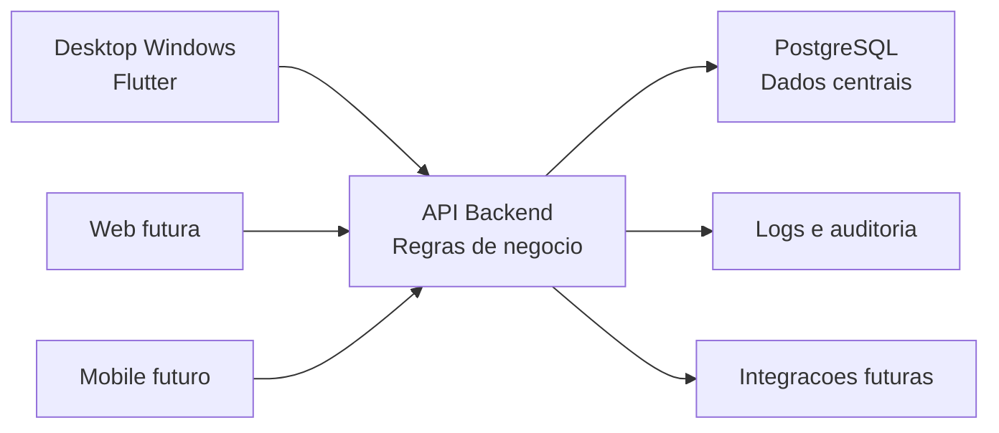

# Arquitetura Recomendada

## Decisao Principal

A recomendacao inicial e separar a aplicacao em tres partes:

1. Aplicativo desktop.
2. API backend.
3. Banco de dados centralizado.

Essa separacao evita que a regra de negocio fique presa na interface desktop e prepara o projeto para Web/mobile.

## Modelo de Arquitetura

## Camadas

### Interface

Responsavel por telas, navegacao, validacoes simples e experiencia do usuario.

### Aplicacao

Responsavel por casos de uso, como criar orcamento, abrir ordem de servico, baixar parcela e reservar estoque.

### Dominio

Responsavel pelas regras principais do negocio. Exemplos:

- Produto nao pode ficar com saldo negativo sem permissao.
- Ordem de servico encerrada nao pode ser alterada livremente.
- Pedido aprovado deve reservar estoque.
- Baixa financeira deve registrar usuario, data e valor.

### Infraestrutura

Responsavel por banco de dados, arquivos, logs, integracoes e envio de mensagens.

## Banco de Dados

Banco recomendado: PostgreSQL.

Motivos:

- Robusto para operacao multiusuario.
- Gratuito e maduro.
- Bom suporte a transacoes.
- Facil de hospedar localmente ou em servidor.
- Preparado para crescimento.

## Escalabilidade

Para 10 desktops, um servidor local ou uma maquina dedicada na rede pode atender bem. A arquitetura deve permitir migrar futuramente para servidor em nuvem sem reescrever o sistema.

## Segurança

- Login individual por usuario.
- Perfis de acesso por modulo e acao.
- Registro de alteracoes importantes.
- Senhas armazenadas com hash seguro.
- Backup automatico.
- Bloqueio de operacoes criticas sem permissao.

## Comentarios no Codigo

O codigo deve ser claro por nomeacao e organizacao. Comentarios devem explicar regras de negocio, decisoes tecnicas e pontos sensiveis, evitando comentarios obvios.
