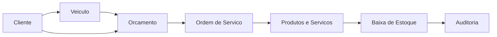

# Fluxo Principal do MVP

## Fluxo

Cliente -> Veiculo -> Orcamento -> Ordem de Servico -> Baixa de Estoque

## 1. Cadastro do Cliente

O usuario cadastra os dados basicos do cliente:

- Nome.
- Documento.
- Telefone.
- E-mail.
- Endereco.
- Observacoes.

Resultado esperado:

- Cliente ativo criado.
- Registro fica disponivel para orcamentos e ordens de servico.

## 2. Cadastro do Veiculo

Quando o atendimento envolver servico automotivo, o usuario vincula um veiculo ao cliente.

Dados iniciais:

- Placa.
- Marca.
- Modelo.
- Ano.
- Cor.
- Observacoes.

Resultado esperado:

- Veiculo vinculado ao cliente.
- Historico futuro podera ser consultado por cliente e por veiculo.

## 3. Orcamento

O usuario cria um orcamento com produtos e servicos.

Regras:

- Orcamento deve ter cliente.
- Veiculo e opcional, mas recomendado para servicos.
- Itens podem ser produto ou servico.
- Totais devem separar produtos, servicos e total geral.
- Status inicial: `draft`.

Status previstos:

- `draft`: em edicao.
- `sent`: enviado ao cliente.
- `approved`: aprovado.
- `rejected`: rejeitado.
- `expired`: vencido.
- `cancelled`: cancelado.

Resultado esperado:

- Orcamento aprovado pode originar ordem de servico.

## 4. Ordem de Servico

A ordem de servico pode ser criada a partir de um orcamento aprovado ou diretamente por atendimento.

Regras:

- Deve ter cliente.
- Deve registrar usuario que abriu.
- Pode ter tecnico responsavel.
- Pode conter produtos e servicos.
- Produtos usados devem gerar movimento de saida no estoque.

Status previstos:

- `open`: aberta.
- `approved`: aprovada para execucao.
- `in_progress`: em execucao.
- `paused`: pausada.
- `completed`: concluida.
- `cancelled`: cancelada.

## 5. Baixa de Estoque

Ao confirmar produtos utilizados na ordem de servico, o sistema registra saida de estoque.

Regras:

- Produto deve existir e estar ativo.
- Quantidade deve ser maior que zero.
- Saldo nao pode ficar negativo no MVP.
- Movimento deve registrar usuario, produto, quantidade, motivo e ordem de servico quando houver.

Resultado esperado:

- Saldo atualizado.
- Historico de movimentacao preservado.
- Auditoria disponivel para conferencias.

## Fluxo Visual

## Primeiro Caso de Teste Manual

1. Cadastrar cliente.
2. Cadastrar veiculo para o cliente.
3. Cadastrar produto com saldo inicial.
4. Cadastrar servico.
5. Criar orcamento com um produto e um servico.
6. Aprovar orcamento.
7. Criar ordem de servico a partir do orcamento.
8. Confirmar uso do produto.
9. Verificar baixa no estoque.
10. Consultar historico da ordem.
